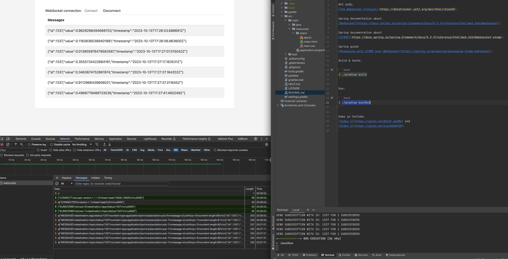

# Spring STOMP WebSockets Demo

RFC 6455:
[The WebSocket Protocol](https://datatracker.ietf.org/doc/html/rfc6455).

Spring documentation about
[WebSocket](https://docs.spring.io/spring-framework/docs/5.3.9/reference/html/web.html#websocket).

Spring documentation about
[STOMP](https://docs.spring.io/spring-framework/docs/5.3.9/reference/html/web.html#websocket-stomp).

Spring guide
[Messaging with STOMP over WebSocket](https://spring.io/guides/gs/messaging-stomp-websocket).

Build & tests:

```bash
$ ./gradlew build
```

Run:

```bash
$ ./gradlew bootRun
```

Now open web client in browser [index.html](./src/main/resources/client/index.html).

Demo on YouTube: 
[Video 1](https://youtu.be/8XuXF_w1QM4) and 
[Video 2](https://youtu.be/IvgJADQAVZ0).


